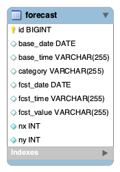

# 단기 예보 프로젝트

## 기능 구현 사항

- [x] 커밋 메시지 컨벤션 설정
- [x] ERD
- [x] API 문서화
- [x] 구현
  - [x] 단기 예보를 DB에 저장하는 API
    - [x] POST 요청시 공공데이터 포털의 API를 호출하여 바로 DB적재
  - [x] 단기 예보를 조회 하는 API
    - [x] GET 요청시 DB 에 저장된 데이터를 조회
    - [x] 데이터가 없을 경우, Http status 204

# ERD

# [API 문서화](https://documenter.getpostman.com/view/28697445/2sA3JM82ch)